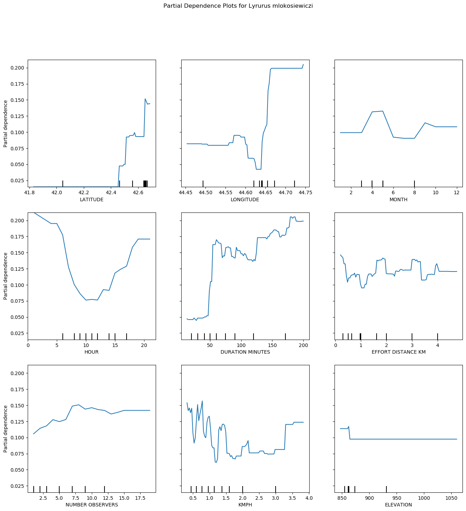
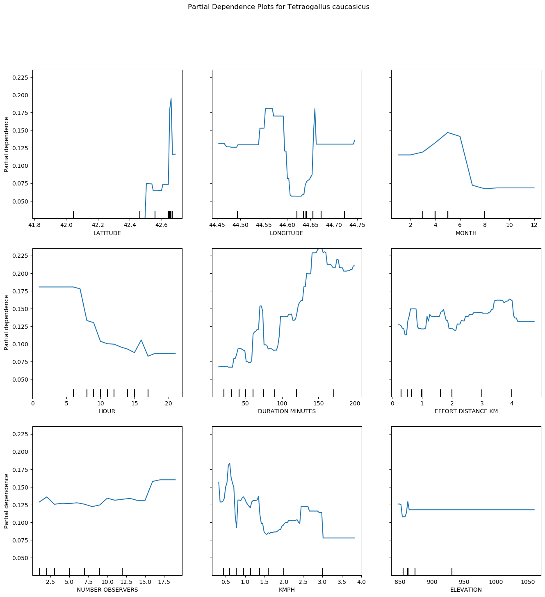

# Caucasian Grouse and Snowcock Sightings In Georgia

## Background Information

The caucasian grouse _(Lyrurus mlokosiewiczi)_ and the caucasian snowcock _(tetraogallus caucasicus)_ are two birds endemic to the Caucasus Mountains, meaning that they can only be found in the wild in this region.

As of July 2023 there are only [572 sightings](https://ebird.org/species/caugro1) of the caucasian grouse on eBird, and [487 sightings](https://ebird.org/species/causno1/) of the caucasian snowcock. In comparison, the black grouse has over 9,000 sightings while the red grouse has almost 30,000 sightings. The two caucasian species are less-studied then many of their Eurasian relatives.

The caucasian grouse is typically found in the altitunidal range ["between upper limits of mountain forests _(Picea orientalis, Betula)_ and subalpine meadows with rhododendron _(Rhododendron caucasicum)_ thickets and stunted birch"](https://doi.org/10.2173/bow.caugro1.01.1). After the chicks hatch in the summer, the females often move to more open meadows with the young while the males move to more protected ravines.

The caucasian snowcock [inhabits areas of the mountains between the treeline and the permanent snow areas](https://birdsoftheworld.org/bow/species/causno1/cur/habitat). During breeding season this is typically between 2400m and 3500m above sea level on north-facing slopes and cliffs. After breeding season they have been known to climb to higher altitudes before descending in autumn and winter.

The Caucasus Mountains themselves span a length of 1200km from the Black Sea to the Caspian Sea, and reach to a height of 5,642m at the peak of Mount Elbrus (the tallest mountain in Europe). This is a huge potential range for the birds.

## Data

Data on bird sightings is from the [eBird Basic Dataset as provided by Cornell Lab](https://science.ebird.org/en/use-ebird-data/download-ebird-data-products). Under the terms of use of the data, the original files cannot be stored on GitHub and so have been included in the `.gitignore`. If you wish to re-run this analysis you will need to download the from eBird and store it in the correct file path.

GeoJSON data for creating maps of Georgia are from [Humanitarian Data Exchange](https://data.humdata.org/dataset/geoboundaries-admin-boundaries-for-georgia). There provide maps of the country at three different resolutions. The relevant files have been stored in the `data` folder.

## Caucasian Grouse and Snowcock Sightings

The first step in sighting these two birds is to look at where they have been sighted in the past. This can be achieved relatively simply by filtering the eBird data for Georgian sightings of the two birds and plotting them on a map.

To ensure that locations are accurate (within a few kilometers) we have filtered out any sightings where the birder travelled over 5km. We have also removed sightings that took place over the timeline of more than 5 hours to keep consistent with future analysis.

The code for the filtering and map plotting can be found in `bird_sightings.py`.

As we can see, sightings for both birds are primarily concentrated in the Mtskheta-Mtianeti region in the north-east of the country. Therefore we will now focus our analysis on this area. The below figure, produced by `bird_sightings_kazbeg.py` shows the sightings in just the Mtskheta-Mtianeti region.

## Time of Sightings

The time of bird sightings is also important. Different species are most active at different times of the day and your chance of seeing the birds will change along with this.

In `time_of_day.py` we create two simple plots of when the species were sighted based on the hour that the observations started.

These graphs are not perfect for two reasons. Firstly, an observation on eBird can span multiple hours. If the start time is 10:00 and the duration is 2.5 hours then the bird could have been spotted at any combination of 10am, 11am, or 12pm.

Secondly, observers may be out looking for the birds more commonly at certain times. While most observations of the birds are in the morning, this does not show whether observers are out more in the morning or whether the birds are more likely to be seen in the morning.

An alternative is to model the occurence of the birds and then analyse the models to see what times the birds are most active.

## Modelling Occurence

We will fit a simple XGBoost model (a gradient boosted random tree model) to model the occurence of the two caucasian birds.

The features we will use in our model are: latitude, longitude, month, hour, duration, distance travelled, number of birders, speed of travel, and elevation.

All features can be obtained from the eBird data except for elevation. To obtain elevation we will use the Open Topo Data API, which requires an API call for each row of data. Since we do not have tens of thousands of rows of data this will not be an issue, but we would need an alternative method if we had more checklists.

The modelling is done in `model_occurence.py`.

## Partial Dependence Plots: Optimising Factors

Once we have our model we can create partial dependence plots to see how we can optimise each factor.

## Similarly Sighted Species

Birds rarely inhabit an environment by themselves. If we are looking for the caucasian grouse or caucasian snowcock, what other birds might we spot that could indicate we are in the right environment?

There are several ways of tackling this question with data. The most simple is to look at each checklist and say, whenever a caucasian grouse is spotted, how often do we see each other species? This analysis has been done in `indicator_species.py` but has a major flaw. Whenever we see a caucasian grouse we might have a 90% chance of seeing a blackbird. Great, so a blackbird indicates we are in the right environment? Not necessarily. We might also have a 90% chance of seeing a blackbird even when we don't see a caucasian grouse.

In `cosine_species.py` we also calculate a cosine similarity between the target species and every other species, where each species has been vectorised based on what checklists it is in. The output for the caucasian grouse and caucasian snowcock can be seen below.

From this chart we know that if we see one of the caucasian birds then we are likely to see the other one. Ring ouzel, water pipit, northern wheatear, and fire-fronted serin are other birds that are likely to indicate the presence of the two caucasian birds. The blackbird, a bird that our rudimentary analysis suggested was a key indicator, still does appear but it's importance is not as strong.